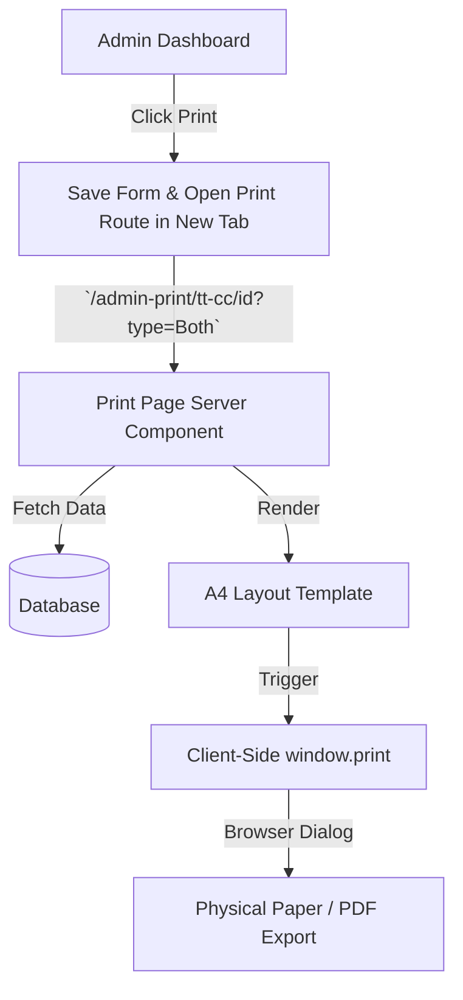

# Technical Guide: Implementing A4 TC & CC Printing in Next.js

This guide explains how certificate printing (Transfer Certificate & Character Certificate) is implemented in this project so you can replicate it in your other projects.

---

## 1. System Architecture

The print system consists of three main parts:
1. **Dynamic Print Page (Server Component)**: Retrieves data from the database and renders the layout using standard HTML/CSS.
2. **Client-Side Trigger Component**: A React component that invokes the browser's native print modal (`window.print()`).
3. **Print CSS Media Queries**: Override styles to format the viewport specifically for A4 paper layout during printing.



---

## 2. Page & Component Layout Strategy

To ensure certificates print correctly without overlapping or spilling onto additional pages, the styling relies on standard physical dimensions (`mm`).

### A4 Dimensions (Standard Portrait)
An A4 sheet is **210mm wide** and **297mm high**.

* **Single Certificate (Full Page)**:
  * Width: `w-[210mm]`
  * Height: `min-h-[265mm]` or `min-h-[297mm]`
* **Double Certificate (Half Page - Both TC & CC on One Page)**:
  * Each block height: `h-[138mm]` (roughly half of 297mm, allowing room for borders and margins)
  * Rendered sequentially inside a single flex container.

### Watermarks (Background Overlay)
An image is placed at the center of the certificate container using absolute positioning:
```tsx
<div className="absolute top-1/2 left-1/2 -translate-x-1/2 -translate-y-1/2 opacity-[0.04] pointer-events-none w-full flex justify-center">
  
</div>
```
> [!NOTE]
> `opacity-[0.04]` (4% opacity) is critical. Higher opacities will obscure text when printed in black and white or on low-contrast printers.

---

## 3. Print-Specific Styling (Tailwind & CSS)

### The `@media print` Stylesheet
To make the page fit the printer output exactly, the following CSS rules are injected onto the page:

```html
<style dangerouslySetInnerHTML={{
  __html: `
  @media print {
    /* Define A4 page dimensions and remove default margin */
    @page { 
      size: A4 portrait; 
      margin: 0; 
    }
    
    /* Ensure background colors/gradients print exactly as designed */
    body { 
      background: white !important; 
      margin: 0 !important; 
      -webkit-print-color-adjust: exact !important; 
      print-color-adjust: exact !important; 
    }
    
    /* Remove preview screen constraints */
    .min-h-screen { 
      min-height: 0 !important; 
      padding: 0 !important; 
    }
    
    .shadow-2xl { 
      box-shadow: none !important; 
    }
    
    .w-[210mm] { 
      width: 100% !important; 
      margin: 0 !important; 
      border: none !important; 
    }
    
    /* Prevent page breaks from splitting a certificate in half */
    .bg-white { 
      page-break-inside: avoid; 
    }
  }
`}} />
```

### Hiding Controls during Print
Any element (e.g., the print button, navigation bars) that should not appear on the paper uses Tailwind's `print:hidden` modifier:
```tsx
<div className="flex justify-end mb-6 print:hidden">
  <PrinterTrigger />
</div>
```

---

## 4. Triggering the Print Dialog

The print action is triggered via client-side JavaScript. Instead of using complex PDF libraries, the browser's native engine formats the A4 page using the print-specific stylesheet.

### Print Button Component (`PrinterTrigger.tsx`)
```tsx
'use client';

import React from 'react';
import { Printer } from 'lucide-react';

export default function PrinterTrigger() {
  const handlePrint = () => {
    window.print();
  };

  return (
    <button
      onClick={handlePrint}
      className="flex items-center gap-2 rounded-full bg-primary px-6 py-3 font-bold text-white shadow-xl transition hover:scale-105 active:scale-95"
    >
      <Printer size={20} />
      Print Certificate
    </button>
  );
}
```

### Auto-Triggering (Optional)
If you want the print dialog to automatically open when the page loads, call `window.print()` inside a `useEffect` on the client component:
```tsx
useEffect(() => {
  const timeout = setTimeout(() => window.print(), 1000);
  return () => clearTimeout(timeout);
}, []);
```

---

## 5. Summary Checklist for Your Other Projects

To implement this style of printing in a new project:

1. **Create the print route**: Define a page template (e.g. `/print/[id]/page.tsx`).
2. **Design using physical units**: Set the container width to `w-[210mm]` and configure the height bounds.
3. **Use the `print:` prefix**: Hide interactive elements (buttons, menus) with `print:hidden`.
4. **Include the CSS print overrides**: Apply `@media print` configuration matching the A4 portrait layout.
5. **Open in a new tab**: Trigger opening the route using `window.open('/print/123', '_blank')`.
6. **Trigger the print dialog**: Call `window.print()` directly from the page layout or button click.
